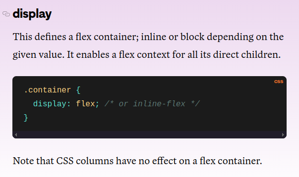

The flexible box layout module (usually referred to as flexbox) is a one-dimensional layout model for distributing space between items  and includes numerous alignment capabilities.
    When we describe flexbox as being one-dimensional we are describing the fact that flexbox deals with layout in one dimension at a time — either as a row or as a column. This can be contrasted with the two-dimensional model of CSS Grid Layout, which controls columns and rows together.

<strong>display</strong> keyboard of flexbox:

The two axes of flexbox
    When working with flexbox you need to think in terms of two axes — the main axis and the cross axis. The main axis is defined by the flex-direction property, and the cross axis runs perpendicular to it. Everything we do with flexbox refers back to these axes, so it is worth understanding how they work from the outset.

The main axis
The main axis is defined by flex-direction, which has four possible values:
    - row
    - row-reverse
    - column
    - column-reverse

Should you choose row or row-reverse, your main axis will run along the row in the inline direction.
Choose column or column-reverse and your main axis will run in the block direction, from the top of the page to the bottom.
<strong>flex-direction</strong>:

<strong>flex-wrap</strong> => By default, flex items will all try to fit onto one line. You can change that and allow the items to wrap as needed with this property.

<strong>flex-flow</strong> => This is a shorthand for the flex-direction and flex-wrap properties, which together define the flex container’s main and cross axes. The default value is row nowrap.

<strong>justify-content</strong>: This defines the alignment along the main axis. It helps distribute extra free space leftover when either all the flex items on a line are inflexible, or are flexible but have reached their maximum size. It also exerts some control over the alignment of items when they overflow the line.

<strong>align-items</strong>: This defines the default behavior for how flex items are laid out along the cross axis on the current line. Think of it as the justify-content version for the cross-axis (perpendicular to the main-axis).

Official Documentation: https://css-tricks.com/snippets/css/a-guide-to-flexbox/